## Overview
### The goal of this project is to create an algorithm using machine learning and neural networks to predict whether applicants will be successful if funded by the fictional non-profit foundation, Alphabet Soup.
----------------------------
----------------------------

## Process
I was given a CSV file that I read into Pandas. This file contained more than 34,000 organizations that have received funding from the fictional foundation along with several columns of metadata about each organization.

***PREPROCESSING*** 
I preprocessed the data by:
* dropping non-beneficial columns, 
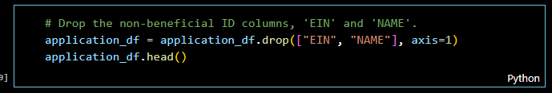
* finding the number of data points for each unique value for each of the columns that had more than 10 unique values - APPLICATION_TYPE and CLASSIFICATION, 
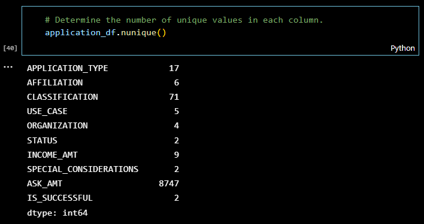
* choosing a cutoff point of 500 and 1000, respectively, to bin rare categorical values together into a new value called "Other", 
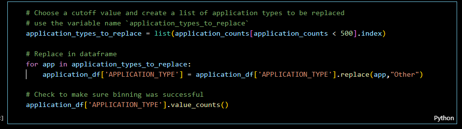
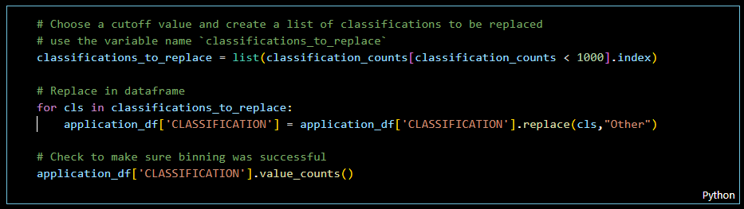
* using `pd.get_dummies()` to convert categorical data to numeric, 
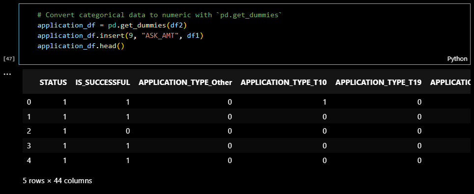
* dividing the data into a target array (IS_SUCCESSFUL) and features arrays, 
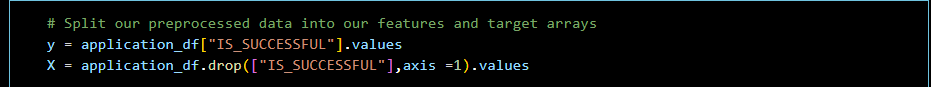
* applying the `train_test_split` to create a testing and a training dataset, 
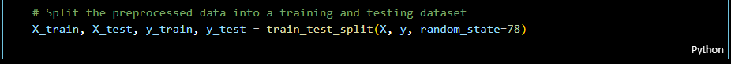
* and finally, using `StandardScaler` to scale the training and testing sets 
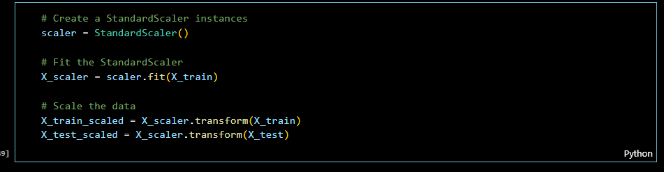

### The resulting data included 44 features. The target variable (y) was IS_SUCCESSFUL. The data was split into training and test subsets.
 

***COMPILING, TRAINING, AND EVALUATING THE MODEL*** 
The model was required to achieve a target predictive accuracy higher than 75%. I made three official attempts using machine learning and neural networks. The first two resulted in the same accuracy rate – right around 73%, so a little short of the required target accuracy.
 
 
Results from each model attempt are detailed below:
 
__ATTEMPT 1__ 

The first attempt (NN_Models/AlphabetSoupCharity_optimisation1.h5) I increased the number of bins of APPLICATION_TYPE & CLASSIFICATION columns and used hyper tuner optimization. Achieved <b>72.97% accuracy</b>.

The hyperparameters used were:
* Input layer: 76 neurons
* Hidden layers: 2
  * Hidden layer1 = 16 neurons : activation function = ‘relu’
  * Hidden layer2 = 16 neurons : activation function = ‘relu'
* Output Layer: 1 neuron : activation function = 'sigmoid'
* epochs = 20

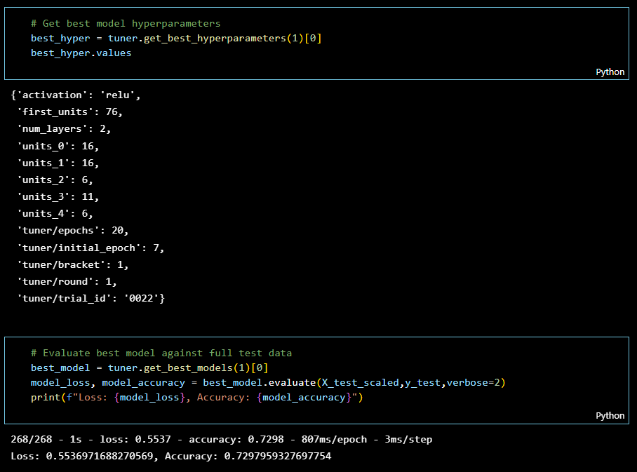

__ATTEMPT 2__ 

For my second attempt (NN_Models/AlphabetSoupCharity_optimisation2.h5) I Increasing the number of hidden layers and number of epochs. This attempt resulted in an <b>accuracy score of 72.99%</b>.

The hyperparameters used were:
* Input layer: 71 neurons
* Hidden layers: 6
  * Hidden layer1 = 36 neurons : activation function = ‘relu’
  * Hidden layer2 = 26 neurons : activation function = ‘relu'
  * Hidden layer3 = 26 neurons : activation function = ‘relu'
  * Hidden layer4 = 11 neurons : activation function = ‘relu'
  * Hidden layer5 = 21 neurons : activation function = ‘relu'
  * Hidden layer6 = 26 neurons : activation function = ‘relu'
* Output Layer: 1 neuron : activation function = 'sigmoid'
* epochs = 50

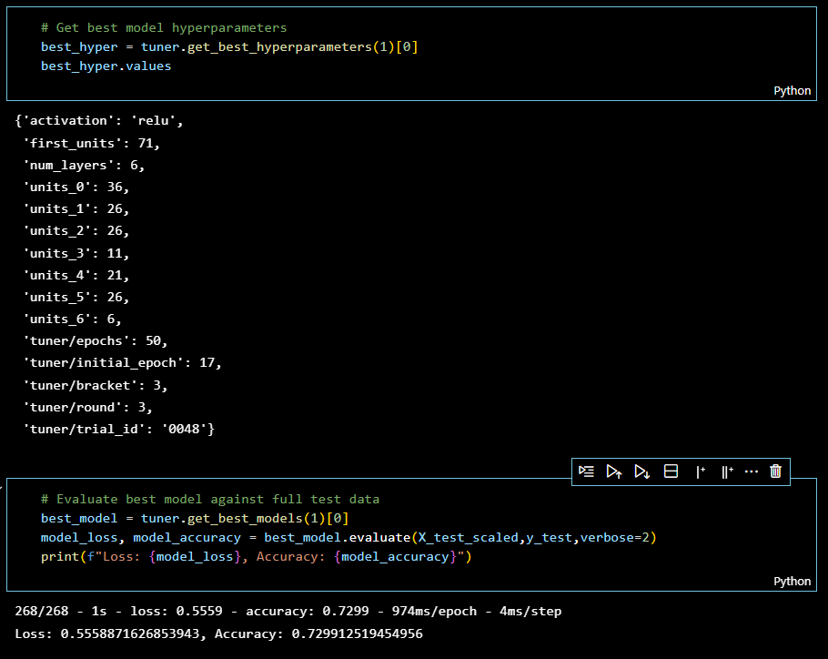

ATTEMPT 3 

For my third and final attempt (Resources/AlphabetSoupCharity3.h5) I review the data cleaning and preprocessing steps and find the NAME column usefull to predict the outcome. This attempt resulted in an <b>accuracy score of 77.3%</b>.

The hyperparameters used were:
* Input layer: 71 neurons
* Hidden layers: 6
  * Hidden layer1 = 36 neurons : activation function = ‘relu’
  * Hidden layer2 = 26 neurons : activation function = ‘relu'
  * Hidden layer3 = 26 neurons : activation function = ‘relu'
  * Hidden layer4 = 11 neurons : activation function = ‘relu'
  * Hidden layer5 = 21 neurons : activation function = ‘relu'
  * Hidden layer6 = 26 neurons : activation function = ‘relu'
* Output Layer: 1 neuron : activation function = 'sigmoid'
* epochs = 50

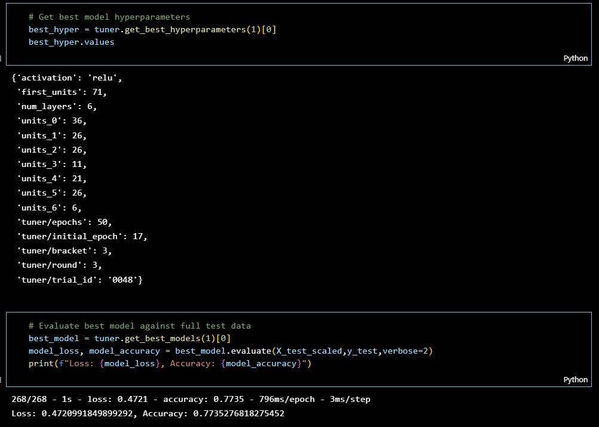

## Summary
Deep learning and other modern nonlinear machine learning techniques get better with more data. Deep learning especially. It is one of the main points that make deep learning so exciting.

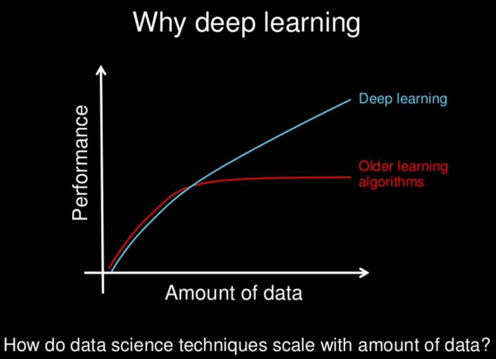

## My Code
VSCode: 
1. DeepLearning.ipynb, 
2. AlphabetSoupCharity_Optimisation1.ipynb,  
3. AlphabetSoupCharity_Optimisation2.ipynb, 
4. AlphabetSoupCharity_Optimisation_Final.ipynb